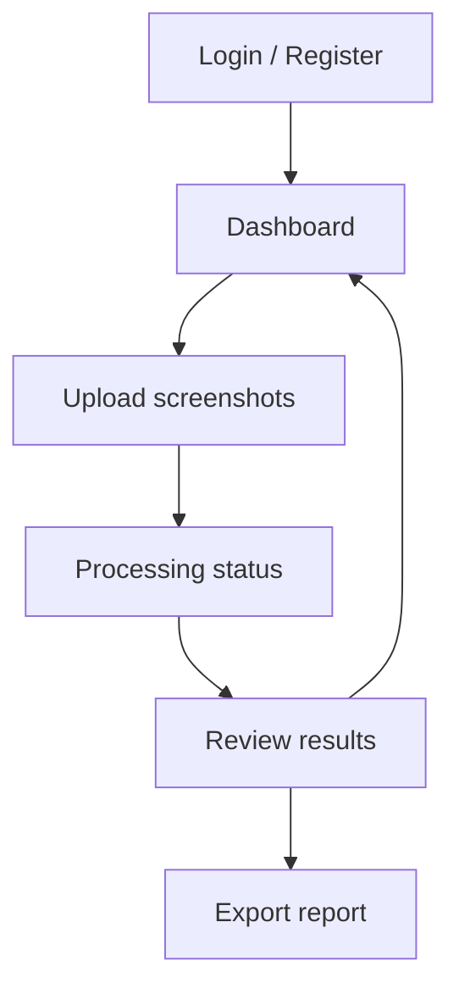

# Design Documentation

This document describes the user interface and experience principles behind LedgerLens, written for an audience with low technical literacy: small business owners and general consumers, not developers.

## Design Principles

1. **One action per screen.** Every screen has a single primary task and a single primary button. The user is never asked to make more than one meaningful decision at a time.
2. **Plain language, no jargon.** Interface copy avoids technical terms. "Reading your photos" instead of "Running OCR pipeline." "Needs review" instead of "Confidence score below threshold."
3. **High contrast, large touch targets.** Buttons are full-width and at least 44px tall, meeting mobile accessibility guidelines. Text defaults to a minimum of 16px body size.
4. **Progress is always visible.** Any operation that takes more than a second or two shows a progress indicator with a plain-language status message, so the user is never left wondering whether the system is working.
5. **Nothing destructive happens silently.** Duplicate detection flags records for review rather than deleting them automatically. The user always makes the final call on ambiguous data.
6. **Numbers before detail.** Summary totals (money in, money out, items needing review) are shown before the detailed transaction table, so the user gets the answer to "how am I doing" immediately.

## Screen Flow

### 1. Login / Register

- Two fields only: email and password.
- A single primary button per state ("Log in" or "Create account"), with a plain-text link to switch between the two.
- Inline validation errors appear directly under the relevant field, in plain language ("This email is already registered" rather than a raw API error).

### 2. Dashboard

- Landing view after login.
- Shows summary cards (total in, total out, items needing review) for the current month by default.
- A single, prominent "Upload photos" button is the primary call to action.
- A transaction list below the summary, sortable by date, with a simple date-range filter.

### 3. Upload Screenshots

- A drag-and-drop area with an equally clear "tap to choose from gallery" affordance for mobile users.
- Accepts multiple files in a single action; no requirement to pre-sort.
- A short, reassuring explanation is shown above the upload area: photos do not need to be sorted first.

### 4. Processing Status

- A progress bar paired with rotating plain-language status messages ("Sorting your photos," "Reading transaction details," "Checking for duplicates").
- No technical logs or error codes are shown at this stage; if a failure occurs, the user is shown a plain-language explanation and a retry option.

### 5. Review Results

- Summary cards recalculated for the batch just processed.
- A highlighted notice appears only when there are items needing review, explaining in one sentence what "needs review" means and what to do about it.
- The transaction table is editable inline for fields that commonly need correction (amount, counterparty, status), without requiring a separate edit screen.

### 6. Export Report

- Two clearly labeled buttons: "Download Excel" and "Download PDF." No format selection dropdown or additional configuration is required for the default export.

## Accessibility Considerations

- Color is never the only signal for status; status labels always include text ("Needs review," "Confirmed"), not color alone.
- All interactive elements are reachable and usable via touch on small screens, since the target audience is assumed to primarily use a mobile device.
- Font sizes do not go below 14px anywhere in the interface, and body text defaults to 16px for readability on smaller screens.
- Forms provide inline, specific error messages rather than generic failure states.

## Visual Language

| Element | Treatment |
|---|---|
| Primary action | Full-width button, solid fill, high contrast against background |
| Secondary action | Outlined or text-only button, visually subordinate to the primary action |
| Status: confirmed | Neutral, low-emphasis styling — this is the expected, unremarkable state |
| Status: needs review / duplicate | Warm accent color (amber), used consistently only for items requiring attention |
| Summary metrics | Large numerals, short label beneath, grouped in cards for quick scanning |

## Implementation Notes

The interface is server-rendered with Jinja2 and styled with Tailwind CSS utility classes, avoiding custom CSS where possible to keep the design system consistent. HTMX handles partial page updates (upload progress, inline table edits, filter changes) without requiring a full client-side JavaScript framework, keeping the frontend implementation within the scope of a solo, time-constrained build.

A low-fidelity Streamlit prototype was used early in development to validate the screen flow before committing to the FastAPI and Tailwind implementation; it is retained in the repository as a reference but is not part of the production application.