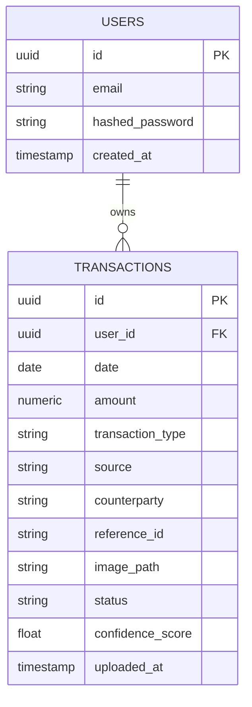

# Database Schema

PostgreSQL, accessed via SQLAlchemy/SQLModel, with migrations managed by Alembic.

## Entity Relationship Overview



## Table: `users`

Stores account credentials. Provided by the existing authentication template; documented here for completeness since `transactions` depends on it.

| Column | Type | Constraints | Description |
|---|---|---|---|
| `id` | UUID | Primary key | Unique user identifier |
| `email` | VARCHAR | Unique, not null | Login identifier |
| `hashed_password` | VARCHAR | Not null | Bcrypt-hashed password, never stored in plaintext |
| `is_active` | BOOLEAN | Default `true` | Allows disabling an account without deletion |
| `created_at` | TIMESTAMP | Default `now()` | Account creation time |

## Table: `transactions`

Stores extracted transaction records, one row per processed screenshot.

| Column | Type | Constraints | Description |
|---|---|---|---|
| `id` | UUID | Primary key | Unique transaction record identifier |
| `user_id` | UUID | Foreign key → `users.id`, not null | Owner of this record; all queries are scoped to this field |
| `date` | DATE | Not null | Transaction date as read from the source image |
| `amount` | NUMERIC(14,2) | Not null | Transaction amount |
| `transaction_type` | VARCHAR | Not null | `incoming` or `outgoing` |
| `source` | VARCHAR | Not null | Payment source, e.g. `BCA`, `GoPay`, `QRIS` |
| `counterparty` | VARCHAR | Nullable | Sender or recipient name, if legible in the image |
| `reference_id` | VARCHAR | Nullable | Bank or wallet reference number, if present |
| `image_path` | VARCHAR | Not null | Storage path of the original uploaded image |
| `status` | VARCHAR | Default `unreviewed` | One of `unreviewed`, `confirmed`, `duplicate`, `rejected` |
| `confidence_score` | FLOAT | Not null | Extraction confidence returned by the vision model |
| `uploaded_at` | TIMESTAMP | Default `now()` | Time the record was created |

### Indexes

| Index | Columns | Purpose |
|---|---|---|
| `ix_transactions_user_id` | `user_id` | Fast per-user filtering, used on every query |
| `ix_transactions_user_date` | `(user_id, date)` | Supports sorting and filtering by date within a user's records |
| `ix_transactions_reference_id` | `reference_id` | Accelerates exact-match deduplication lookups |

### Data Isolation Rule

Every query against `transactions` must be scoped with `WHERE user_id = :current_user_id`. This is enforced at the service layer (`app/services/`), not left to individual route handlers, to prevent accidental cross-account data exposure.

## SQLModel Definitions

```python
from datetime import date, datetime
from uuid import UUID, uuid4
from sqlmodel import SQLModel, Field


class User(SQLModel, table=True):
    __tablename__ = "users"

    id: UUID = Field(default_factory=uuid4, primary_key=True)
    email: str = Field(unique=True, index=True, nullable=False)
    hashed_password: str = Field(nullable=False)
    is_active: bool = Field(default=True)
    created_at: datetime = Field(default_factory=datetime.utcnow)


class Transaction(SQLModel, table=True):
    __tablename__ = "transactions"

    id: UUID = Field(default_factory=uuid4, primary_key=True)
    user_id: UUID = Field(foreign_key="users.id", index=True, nullable=False)
    date: date = Field(nullable=False)
    amount: float = Field(nullable=False)
    transaction_type: str = Field(nullable=False)      # "incoming" | "outgoing"
    source: str = Field(nullable=False)
    counterparty: str | None = Field(default=None)
    reference_id: str | None = Field(default=None, index=True)
    image_path: str = Field(nullable=False)
    status: str = Field(default="unreviewed")           # unreviewed | confirmed | duplicate | rejected
    confidence_score: float = Field(nullable=False)
    uploaded_at: datetime = Field(default_factory=datetime.utcnow)
```

## Migration Notes

- Migrations are generated and applied with Alembic (`alembic revision --autogenerate`, `alembic upgrade head`).
- The `transactions` table depends on `users` already existing; if `users` originates from the authentication template, confirm its table name and primary key type (`UUID` is assumed here) match before generating the `transactions` migration.
- Run `alembic upgrade head` against both the local development database and the production (Neon) database — migrations are not applied automatically on deploy unless explicitly wired into the deployment pipeline.